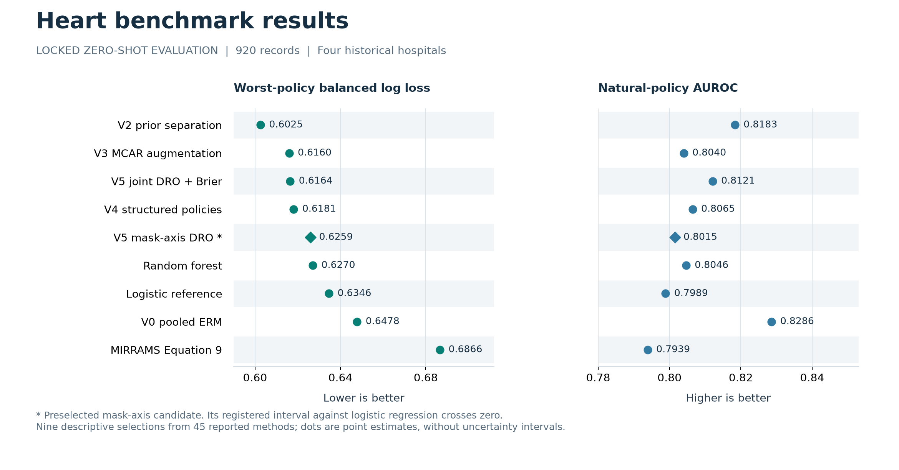

# HeartShift

**Hospital and measurement-policy shift in clinical tabular prediction**

[](https://github.com/abdullahuseyinli-dot/heart-disease-risk-model-benchmark/actions/workflows/ci.yml)
[](https://www.python.org/)
[](LICENSE)

**Can a disease classifier trained in some hospitals work in an unseen hospital,
even when fewer measurements are available?** HeartShift investigates this
question by comparing standard classifiers with methods that separate disease
evidence from hospital prevalence and train for missing measurements.

The evaluation trains and selects models using three hospitals, tests on the
fourth, and repeats this for every hospital. It measures both classification
with the recorded measurements and probability quality when additional
measurements are deliberately hidden. Saved predictions make the results
reproducible.

The main task uses **920 records from four UCI Heart Disease cohorts**. The
endpoint is historical angiographic disease status (`num > 0`).
Hospital identity defines the evaluation splits and is excluded from model
features. All preprocessing, tuning, calibration, and threshold selection use
source hospitals only.

[Results](docs/RESULTS.md) · [Understanding the metrics](docs/METRICS.md) ·
[Methods and development](docs/RESEARCH_ATLAS.md) ·
[Setup and verification](docs/USAGE.md) · [Documentation](docs/README.md)

> Research software, not a medical device. This benchmark does not estimate
> prospective cardiovascular risk or support individual clinical decisions.

## Classification results

How well do the models classify disease at an unseen hospital using the measurements as recorded? The table below answers this complementary question. **Natural measurements; decision threshold 0.5; equal weight for each of the four hospitals.**

| Model | Accuracy ↑ | Balanced accuracy ↑ | Precision ↑ | Recall ↑ | F1 ↑ | AUROC ↑ | Brier ↓ |
| --- | ---: | ---: | ---: | ---: | ---: | ---: | ---: |
| V2 · prior separation | 77.57% | 72.59% | 82.88% | 78.71% | 80.35% | 0.8183 | 0.154621 |
| V0 · pooled ERM | 77.36% | 72.30% | 77.99% | 85.73% | 80.74% | 0.8286 | 0.152071 |
| V5 · mask-axis DRO (preselected) | 75.98% | 72.55% | 81.31% | 77.05% | 78.77% | 0.8015 | 0.159715 |
| Random forest | 75.10% | 71.77% | 81.87% | 77.12% | 78.78% | 0.8046 | 0.177834 |
| Logistic regression | 73.59% | 70.74% | 83.20% | 71.03% | 76.40% | 0.7989 | 0.176660 |

These five methods illustrate prior separation, pooled training (ERM), the preselected measurement-robust candidate (DRO), and two classical references. The classical references use site/class-balanced training. Values are descriptive point estimates, not a new model-selection result. AUROC and Brier use probabilities without a decision threshold; Brier here is unweighted within each hospital.

[All 45 methods and downloadable table](docs/RESULTS.md#natural-measurement-metrics) · [Metric definitions and why log loss is primary](docs/METRICS.md).

## Findings

Balanced log loss (BLL) measures probability quality with equal class weight; lower is better. The heart primary metric averages each hospital's worst measurement-policy loss. These experiments have different evidence scopes.

| Experiment | Recorded result | Interpretation |
| --- | --- | --- |
| [Locked heart evaluation](docs/RESULTS.md#locked-heart-evaluation) | V2 prior separation: **0.602509**. Preselected V5 mask-axis DRO: 0.625949. | V2 had the lowest point estimate among 45 methods. V5's registered interval against logistic regression crossed zero. |
| [Ten-seed sensitivity](docs/RESULTS.md#seed-stability) | V4 structured policies: **0.600458**; random forest: 0.625463. | Post-outcome analysis. Familywise intervals crossed zero; superiority remains unconfirmed. |
| [Independent readmission task](docs/RESULTS.md#independent-readmission-task) | Joint PS-MaskDRO: **0.672257**; pooled ERM: 0.719939. | Exploratory direct contrast favors DRO on worst-mask loss. ERM retained higher natural-policy AUROC. |
| [Support-aware routing](docs/RESULTS.md#backbones-and-routing) | Router: 0.619081; equal-logit blend: **0.615985**. | The router failed its robust-improvement gate. |

The heart compatibility gate abstained in all 432 evaluated adaptation cells. The separate ShiftGuard development study failed its final acceptance gate. Both outcomes are documented in [adaptation and diagnostics](docs/RESULTS.md#adaptation-and-diagnostics).

## Hospital shift and measurement robustness



*Nine descriptive selections from the locked evaluation. Lower balanced log loss
and higher AUROC measure different aspects of prediction. The
[complete 45-method table and registered intervals](docs/RESULTS.md#locked-heart-evaluation)
include all calibrated variants and weaker results.
[Plot data](assets/research/locked_heart_overview.csv) ·
[Vector figure](assets/research/locked_heart_overview.svg).*

## What the repository contains

| Component | Purpose | Entry point |
| --- | --- | --- |
| Benchmark contract | Hospital-held-out evaluation, deletion policies, balanced proper scores, and conditional uncertainty | [Benchmark card](docs/BENCHMARK_CARD.md) |
| Method development | Prior separation, measurement-policy DRO, acquisition-neutral evidence, adaptation diagnostics, and routing | [Research atlas](docs/RESEARCH_ATLAS.md) |
| Experiment results | Complete method tables, registered comparisons, seed sensitivity, and negative findings | [Results](docs/RESULTS.md) |
| Reproducible software | Typed package, validated configurations, immutable prediction contracts, and offline checks | [Architecture](docs/ARCHITECTURE.md) |
| Evidence archive | Raw sources, splits, predictions, report manifests, failures, and historical coursework | [Artifact guide](docs/ARTIFACTS.md) |
| Trial history | 56 retained run directories, 12 report directories, and the separate failure package | [Experiment ledger](docs/research/EXPERIMENT_LEDGER.md) |

## Quick start

For code review and local development, skip the multi-gigabyte Git LFS archive:

```powershell
$env:GIT_LFS_SKIP_SMUDGE = "1"
git clone https://github.com/abdullahuseyinli-dot/heart-disease-risk-model-benchmark.git
Remove-Item Env:GIT_LFS_SKIP_SMUDGE
Set-Location heart-disease-risk-model-benchmark
uv sync --locked --extra dev --extra reporting --extra neural-cpu
uv run heartshift --version
uv run heartshift contracts validate --repo-root .
```

Python 3.11 and 3.12 are supported. The [setup guide](docs/USAGE.md) includes
POSIX commands, optional model dependencies, targeted evidence retrieval, and
the full audit procedure.

Run the local quality checks:

```powershell
uv run pytest -q -m "not full_evidence" --cov=heartshift --cov-config=configs/coverage/source-only.coveragerc
uv run ruff check src tests tools
uv run ruff format --check src tests tools
uv run mypy
uv run python tools/validate_repository.py
uv run python tools/build_results_document.py --check
uv run python tools/build_research_atlas.py --check
uv run python tools/plot_research_overview.py --check
```

These checks use the source tree, synthetic fixtures, and compact evidence.
The [full evidence audit](docs/USAGE.md#evidence-checkout) additionally retrieves
Git LFS objects and verifies prediction bindings and reconstruction.
Figures and public tables can be rebuilt from saved results without fitting models.

## Development record

The project began as a group coursework benchmark. The subsequent HeartShift
study introduced hospital-preserving splits, source-only selection, and fixed
measurement interventions. Later work investigated adaptation diagnostics,
matched backbones, support-aware routing, and seed stability.

The [research atlas](docs/RESEARCH_ATLAS.md) records the hypotheses, decisions,
implementations, and outcomes. The [coursework record](docs/legacy/COURSEWORK_PROVENANCE.md)
credits the original group and links the recovered notebooks' source extracts,
CV tables, calibration plots, SHAP analyses, and systems trials.
Historical failures and recovery records remain part of the evidence archive.

## Scope

The four heart cohorts are small, historical, and clinically referred.
Switzerland contains only eight negative records. Bootstrap intervals condition
on the observed sites and fitted models; additional seeds or deletion policies
do not add patients. The readmission experiment uses a different endpoint and
an admission-source domain proxy. The eICU demo checks pipeline execution only.

The evidence supports conclusions about this benchmark, including ensemble
stability and failed methodological hypotheses. It does not establish clinical
utility, general superiority, unrestricted MNAR robustness, or transport to
future hospitals. [Data card](docs/DATA_CARD.md) ·
[Model card](docs/MODEL_CARD.md) · [Claim boundaries](paper/CLAIM_EVIDENCE_CROSSWALK.md).

## Contributing and citation

See [CONTRIBUTING.md](CONTRIBUTING.md) for development and evidence requirements.
Software citation metadata are in [CITATION.cff](CITATION.cff); no archive DOI or
immutable software release is claimed.

Repository-authored code and documentation use the [MIT License](LICENSE).
Datasets and external implementations retain their own terms and attribution,
documented in [THIRD_PARTY_NOTICES.md](THIRD_PARTY_NOTICES.md).
