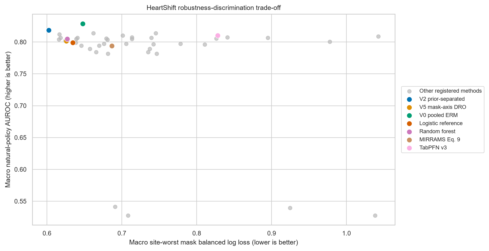

# HeartShift

*An auditable benchmark for hospital and measurement-policy shift in clinical tabular prediction*

[](https://github.com/abdullahuseyinli-dot/heart-disease-risk-model-benchmark/actions/workflows/ci.yml)
[](https://www.python.org/)
[](LICENSE)
[](CHANGELOG.md)

HeartShift evaluates clinical tabular models when both the patient population and
the recorded feature panel change between sites. The primary task uses the four
hospital cohorts in the UCI Heart Disease collection. The endpoint is historical
angiographic disease status (`num > 0`), not prospective cardiovascular risk.

Hospital identity defines splits and audit groups. It is never supplied to a
disease classifier. Preprocessing, model selection, early stopping, calibration,
and threshold selection use source hospitals only.

> HeartShift is research software, not a medical device. Its outputs are not
> suitable for diagnosis, treatment, or individual clinical decisions.

**Explore the work:** [research ideas and outcomes](docs/RESEARCH_ATLAS.md) ·
[complete experiment ledger](docs/research/EXPERIMENT_LEDGER.md) ·
[local/Git audit](docs/audit/2026-09-20/REPOSITORY_AUDIT.md) ·
[recovered coursework](docs/legacy/COURSEWORK_PROVENANCE.md).

The ledger covers 56 retained runs and 12 report packages. The September 2026
audit also recovered 121 original coursework outputs and indexed 68 notebook
code cells. These are preserved artifacts, not additional independent trials.

## Results at a glance

The primary heart metric is macro hospital worst-policy balanced log loss; lower
is better. It gives each hospital and outcome class equal weight and evaluates a
fixed bank of measurement-deletion policies.

| Evidence track | Main observation | Status |
| --- | --- | --- |
| Locked heart evaluation | V2 prior-separated training recorded the lowest primary loss among 45 methods: **0.602509**. The preselected V5 mask-axis DRO candidate recorded 0.625949 and did not confirm superiority over the logistic reference. | Locked outcomes consumed; conditional on four historical hospitals. |
| Ten-seed stability analysis | The V4 structured-policy ensemble recorded the lowest later point estimate, **0.600458**, versus 0.625463 for random forest. Familywise intervals cross zero. | Post-outcome sensitivity result, not confirmation. |
| Patient-disjoint readmission task | Joint PS-MaskDRO recorded **0.672257** worst-mask loss versus 0.719939 for pooled ERM. Pooled ERM retained higher AUROC. | Exploratory direct contrast on an independent task; admission source is a domain proxy, not a hospital identifier. |
| Unlabelled adaptation | The compatibility gate abstained in all 432 heart evaluation cells and prevented severe degradation from the fixed ungated corrections. | Safety/mechanism result; no successful real-data adaptation claim. |
| Support-aware routing | The learned router recorded 0.619081 versus 0.615985 for equal-logit blending. | Prespecified negative result. |

The strongest supported conclusion is methodological: robust probability scores
depend on the evaluation environment and can disagree with AUROC rankings;
simple model and seed averaging was more reliable here than hard source-only
selection. The data do not establish state of the art, clinical validity, or
generalization to future hospitals.

Detailed results are available in the [locked heart report](docs/HEART_OUTER_V5_RESULT.md),
the [ten-seed stability report](docs/HEART_RESEARCH_DEVELOPMENT_RESULT.md), and the
[readmission report](docs/READMISSION_OUTER_V3_RESULT.md).



*Descriptive view of the locked heart report. Better AUROC does not necessarily
mean better worst-policy probability scores. See the
[plotted data](artifacts/figures/heartshift-v5-r2/heart_robustness_vs_auc.csv)
and [figure provenance](artifacts/figures/heartshift-v5-r2/figure_manifest.json).
The [research atlas](docs/RESEARCH_ATLAS.md) adds the full seed-stability comparison
and the ShiftGuard revision/failure plot.*

## Evidence classes

| Class | Scope | Public interpretation |
| --- | --- | --- |
| Legacy benchmark | Original stratified-holdout benchmark, systems checks, and saved outputs. | Historical development evidence only. |
| Locked heart evaluation | Source-selected methods evaluated on each held-out hospital after versioned freezes and two documented recovery events. | Main heart benchmark; not a fresh joint preregistration of every recovered run. |
| Independent task | Patient-disjoint UCI diabetes-readmission experiment. | Cross-task evidence for measurement robustness, not heart validation. |
| Development and sensitivity | Ten-seed extensions, equal-budget backbones, routing, and ShiftGuard revisions after heart outcomes were known. | Mechanism and stability evidence only. |
| Pipeline smoke tests | Public eICU demo execution. | Schema and execution checks; no scientific performance claim. |

Evidence status is stored with each report and must remain attached when results
are reused. Failed gates, abstentions, partial runs, and recovery records are part
of the audit trail.

## Benchmark contract

- **Primary data:** 920 records from Cleveland, Hungary, Switzerland, and VA Long Beach.
- **Outcome:** binary angiographic disease status derived from `num > 0`.
- **Partitioning:** outer leave-one-hospital-out evaluation with nested leave-one-source-hospital-out selection.
- **Features:** 13 clinical variables with explicit natural-missingness indicators.
- **Interventions:** deterministic natural, MCAR, MAR, empirical, and whole-panel deletion policies. Policies remove observed information; they never reveal missing values.
- **Primary estimand:** mean across hospitals of each hospital's worst-policy balanced log loss.
- **Uncertainty:** paired record bootstrap within each observed hospital. Intervals are conditional on these four sites and fitted models.
- **Evidence:** sample-level predictions keyed by `sample_id`, exact mask identity, resolved configuration, run manifest, hashes, and independent reconstruction.

The complete reusable contract is in the [benchmark card](docs/BENCHMARK_CARD.md).
Data provenance and endpoint definitions are in the [data card](docs/DATA_CARD.md).

## Installation

HeartShift supports CPython 3.11 and 3.12 and uses `uv` for locked environments.

For a code-only checkout, skip the multi-gigabyte LFS download:

```powershell
$env:GIT_LFS_SKIP_SMUDGE = "1"
git clone https://github.com/abdullahuseyinli-dot/heart-disease-risk-model-benchmark.git
Remove-Item Env:GIT_LFS_SKIP_SMUDGE
Set-Location heart-disease-risk-model-benchmark
uv sync --locked --extra dev --extra reporting --extra neural-cpu
```

Install the optional benchmark implementations only when needed:

```powershell
uv sync --locked --extra dev --extra reporting --extra classical `
  --extra foundation-models --extra neural-cuda
```

TabPFN v3 requires separate acceptance of its upstream terms and a credential in
the provider's user cache. Credentials must never be placed in this repository,
configuration files, or shell history.

## Verify the repository

The routine quality gate uses source code, synthetic fixtures, and compact
canonical data:

```powershell
uv run pytest -q -m "not full_evidence" --cov=heartshift `
  --cov-config=configs/coverage/source-only.coveragerc --cov-report=term-missing
uv run ruff check src tests tools
uv run ruff format --check src tests tools
uv run mypy
uv run heartshift --version
uv run heartshift contracts validate --repo-root .
uv run python tools/validate_repository.py
uv run python tools/build_research_atlas.py --check
uv run python tools/plot_research_overview.py --check
uv build
uv run python tools/validate_distribution.py
uv run python tools/smoke_install_distribution.py
```

Large prediction evidence is stored through Git LFS. A full evidence audit also
requires the LFS objects:

```powershell
git lfs install
git lfs pull
git lfs fsck
uv run heartshift validate --repo-root .
uv run heartshift contracts validate --repo-root . --verify-bindings
uv run pytest -q --cov=heartshift --cov-report=term-missing
```

The [installation and verification guide](docs/USAGE.md) separates lightweight
checks, targeted report retrieval, and full-evidence verification. The
[artifact guide](docs/ARTIFACTS.md) documents storage, hashes, and release bundles.

## Repository map

```text
src/heartshift/        benchmark, model, evaluation, and audit code
configs/               versioned data, method, experiment, report, and freeze configs
manifests/             dataset, environment, table, report, and release-facing contracts
tests/                 synthetic leakage, metric, contract, and reconstruction tests
data/                  raw sources, canonical tables, profiles, and split manifests
artifacts/             locks, prediction evidence, reports, figures, and preserved failures
docs/                  protocol, cards, results, limitations, and audit history
results/               preserved legacy benchmark outputs
results/legacy_coursework_2025/ recovered original coursework tables and plots
scripts/               preserved legacy benchmark and systems scripts
paper/                 manuscript-facing evidence index
```

The current evidence state is summarized in [project status](docs/PROJECT_STATUS.md).
The documentation index is [docs/README.md](docs/README.md).
The [architecture](docs/ARCHITECTURE.md), [acquisition runbook](docs/DATA_ACQUISITION_RUNBOOK.md),
[hardware record](docs/HARDWARE.md), and [release gate](docs/RELEASE_EVIDENCE_GATE.md)
define the operational and release boundaries.

## Scope and claim limits

HeartShift does not claim prospective cardiovascular risk prediction, clinical
utility, safety, fairness, unrestricted MNAR robustness, universal superiority
of PS-MaskDRO, or inference over a population of future hospitals. Repeated masks,
methods, and seeds produce many prediction rows but do not increase the 920-record
heart sample. The Switzerland cohort contains only eight negative records, so
site-level conclusions require particular care.

The original holdout benchmark remains available for provenance in the
[legacy benchmark record](docs/legacy/LEGACY_BENCHMARK.md). It is not part of the
current HeartShift comparison.

The [coursework provenance guide](docs/legacy/COURSEWORK_PROVENANCE.md) credits
the original group project and maps its notebooks, detailed tables, diagnostic
plots, failed Dask experiment, and Colab latency trial to retained evidence.

## Citation and licensing

Citation metadata are provided in [`CITATION.cff`](CITATION.cff). No DOI is
claimed until an immutable release has been deposited.

Repository-authored code and documentation are licensed under the [MIT License](LICENSE).
Third-party datasets retain their original terms. Dataset citations,
redistribution conditions, and transformation notices are listed in
[THIRD_PARTY_NOTICES.md](THIRD_PARTY_NOTICES.md).
