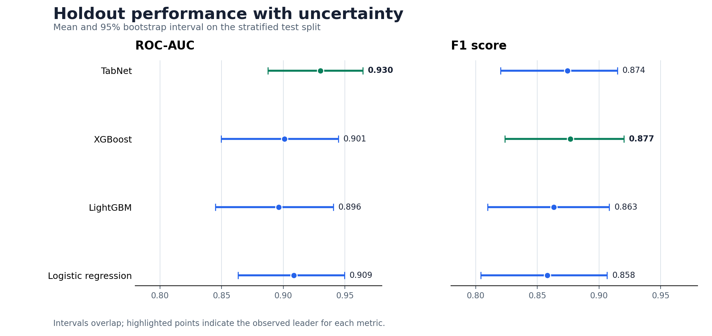

# HeartShift: hospital and missingness-shift benchmark

[](https://github.com/abdullahuseyinli-dot/heart-disease-risk-model-benchmark/actions/workflows/ci.yml)

A leakage-audited research benchmark for hospital shift, measurement-policy
shift, and missing clinical features in the four-centre UCI Heart Disease
collection. The endpoint is historical angiographic disease status (`num > 0`),
not prospective cardiovascular risk.

> This is a technical benchmark, not a medical device. Its outputs must not be
> used for diagnosis, treatment, or individual clinical decisions.

## Current HeartShift study

The active study uses outer leave-one-hospital-out evaluation, inner
leave-one-source-hospital-out selection, deterministic structured mask policies,
three-seed model confirmation, prediction-level evidence, paired uncertainty,
and an independent patient-disjoint UCI diabetes-readmission task. Hospital
identity defines splits and robustness groups but is never a prediction feature.

Strong comparators include regularized linear and tree ensembles, EBM, TabPFN v2
and v3, TabICL, TabM, RealMLP, FT-Transformer, a MIRRAMS reproduction, and the
observed-set PS-MaskDRO ablation family. Classical and modern methods retain both
raw probabilities and a separately named source-out-of-fold Platt sensitivity
track. Zero-shot domain generalization and diagnostic-gated unlabelled-target
adaptation are never merged into one leaderboard.

The registered protocol-v1 joint site-by-policy DRO gate failed one of seven
source-only criteria. That failure is preserved. Before any outer label access,
a deterministic protocol-v2 rule selected the measurement-policy-only DRO
variant (`v5_mask_only_dro`) for the locked benchmark. This is explicitly
source-informed model selection, not an independent confirmation result. The
protocol-v2 synthetic diagnostic gate subsequently failed and is preserved; its
mechanism analysis is in
[the synthetic-v2 failure record](docs/SYNTHETIC_V2_FAILURE.md). The
[registered protocol-v3 mechanism study](docs/SYNTHETIC_V3_PROTOCOL.md) then
passed all eight gates; its [prediction-reconstructed result](docs/SYNTHETIC_V3_RESULT.md)
separates pure label shift from MAR acquisition shift, conditional shift, and
target-only MNAR. The independent readmission source-only study and its evidence
audit are also complete.

Five protocol-v3 outer evaluations completed and independently reconstruct with
zero prediction-ensemble and metric differences: classical, modern-v2,
modern-2026, TabPFN-v3, and patient-disjoint readmission. The first MIRRAMS v3
shard encountered a non-adaptable orchestration defect before any held-out heart
endpoint was loaded; that failed run is preserved and PS-MaskDRO v3 was not
launched. The exact disclosure and neural-only v4 recovery are documented in
[the v3 failure and v4 recovery record](docs/OUTER_V3_FAILURE_AND_V4_RECOVERY.md).
MIRRAMS v4 subsequently fixed all shard predictions but exposed an exact-filename
aggregation defect after the canonical endpoint join; no metric file was written
and PS-MaskDRO v4 was not launched. The preserved failure and no-refit v5 recovery
are documented in
[the v4 failure and v5 recovery record](docs/OUTER_V4_FAILURE_AND_V5_RECOVERY.md).
The [locked v5 heart result](docs/HEART_OUTER_V5_RESULT.md) is complete and fully
reconstructed. V2 prior separation is strongest on the heart primary robust
proper-score estimand; the preselected V5 mask-axis DRO result is
non-confirmatory. Joint PS-MaskDRO is strongest on the independent readmission
robust proper-score estimand. The acquisition-aware gate abstains on every heart
target cell and prevents severe post-hoc degradation from invalid label-shift
correction. See the
[independent readmission outer result](docs/READMISSION_OUTER_V3_RESULT.md).

A subsequent consumed-outcome research study expands the strongest controls and
observed-set models to ten seeds, compares attention with equal-budget DeepSets,
and evaluates a source-selected support-aware router. The router fails its robust
improvement gate. An exact bit-for-bit extension of the historical PS-MaskDRO
seed bank finds that ten-seed V4 structured-policy ensembling has the best point
estimate (0.600458), but post-hoc familywise intervals cross zero. The result is a
stability/mechanism finding, not new confirmation; see the
[heart research development result](docs/HEART_RESEARCH_DEVELOPMENT_RESULT.md).

Research documentation:

- [Research protocol](docs/RESEARCH_PROTOCOL.md)
- [Method specification](docs/METHOD_SPECIFICATION.md)
- [Reproducibility runbook](docs/REPRODUCIBILITY.md)
- [Synthetic protocol-v3 result](docs/SYNTHETIC_V3_RESULT.md)
- [Independent readmission source-only result](docs/READMISSION_INNER_V1_RESULT.md)
- [Independent readmission outer result](docs/READMISSION_OUTER_V3_RESULT.md)
- [Locked heart outer result](docs/HEART_OUTER_V5_RESULT.md)
- [Publication route and claim boundaries](docs/PUBLICATION_ROUTE.md)
- [ShiftGuard v1 development and external-confirmation protocol](docs/SHIFTGUARD_V1_PROTOCOL.md)
- [ShiftGuard power-aware method specification](docs/SHIFTGUARD_POWER_GUARD_SPEC.md)
- [ShiftGuard iterative development result](docs/SHIFTGUARD_DEVELOPMENT_RESULT.md)
- [Support-router protocol amendment and corrected outer route](docs/SUPPORT_ROUTER_PROTOCOL_AMENDMENT.md)
- [Post-outcome heart sensitivity analysis](docs/HEART_OUTER_V5_SENSITIVITY.md)
- [Public eICU demo execution smoke result](docs/EICU_DEMO_SMOKE_RESULT.md)
- [Heart research development and ten-seed stability result](docs/HEART_RESEARCH_DEVELOPMENT_RESULT.md)
- [Outer evidence audit](docs/OUTER_EVIDENCE_AUDIT.md)
- [v3 failure and v4 neural recovery](docs/OUTER_V3_FAILURE_AND_V4_RECOVERY.md)
- [v4 failure and v5 exact-aggregation recovery](docs/OUTER_V4_FAILURE_AND_V5_RECOVERY.md)
- [Data card](docs/DATA_CARD.md)
- [Model card](docs/MODEL_CARD.md)
- [Limitations](docs/LIMITATIONS.md)

## Preserved legacy benchmark

The material below describes the original student benchmark and its historical
20% holdout evidence. It is retained for provenance and is not the confirmatory
HeartShift design.



## Evaluation snapshot

The table below is read from the tracked 20% stratified holdout results in
[`holdout_models.csv`](results/main/metrics/test/holdout_models.csv).

| Model | Accuracy | F1 | ROC-AUC | Brier score |
| --- | ---: | ---: | ---: | ---: |
| Logistic regression | 0.8370 | 0.8585 | 0.9083 | 0.1183 |
| LightGBM | 0.8424 | 0.8638 | 0.8962 | 0.1192 |
| XGBoost | **0.8587** | **0.8774** | 0.9010 | 0.1151 |
| TabNet | 0.8533 | 0.8744 | **0.9302** | **0.1066** |

Bootstrap intervals keep the small-sample uncertainty visible:

| Model | ROC-AUC 95% interval | F1 95% interval |
| --- | ---: | ---: |
| Logistic regression | [0.8633, 0.9495] | [0.8041, 0.9065] |
| LightGBM | [0.8450, 0.9406] | [0.8098, 0.9083] |
| XGBoost | [0.8497, 0.9447] | [0.8235, 0.9202] |
| TabNet | [0.8876, 0.9645] | [0.8203, 0.9148] |

These intervals overlap. The repository therefore reports different leaders by
metric instead of presenting a single model as conclusively superior.

## Experiment design

- **Dataset:** 920 processed records and 28 columns; `num > 0` is the positive
  class.
- **Split:** stratified 80/20 holdout with random seed 42.
- **Model selection:** nested cross-validation for logistic regression and
  LightGBM; cross-validation summaries are retained for all tree baselines.
- **Probability quality:** Brier decomposition, calibration slope/intercept,
  calibration curves, and threshold analysis.
- **Uncertainty:** 1,000 holdout bootstrap resamples.
- **Interpretability:** SHAP summaries, a depth-three surrogate tree,
  counterfactual examples, and cross-model SHAP rank agreement.
- **Subgroups:** accuracy, recall, F1, AUC, TPR, and FPR by recorded sex.

The strongest tracked cross-validation mean AUC is 0.896 for logistic
regression. SHAP rankings from LightGBM and logistic regression have Spearman
correlation 0.771 on the retained comparison.

## Systems experiments

The repository includes two deliberately separate systems checks:

- A local FastAPI benchmark recorded 2,760 requests at 14.61 ms mean latency,
  33.25 ms p95, and 91.06 requests/second.
- The Dask LightGBM run reached 0.533 ROC-AUC versus 0.896 for the single-node
  baseline and took substantially longer on this small dataset. This is a useful
  negative result: distributed execution adds overhead and is not justified at
  this scale.

Hardware, process placement, and background load affect latency. The tracked
numbers characterize one recorded run, not a deployment service-level
objective.

## Reproduce the benchmark

Python 3.10 or newer is recommended.

```bash
python -m venv .venv
# Windows: .venv\Scripts\activate
# macOS/Linux: source .venv/bin/activate
python -m pip install --upgrade pip
python -m pip install -r requirements.txt
```

The public repository includes the processed parquet dataset. Full regeneration
also requires the original `heart_disease_uci.csv` at the repository root:

```bash
python scripts/heart_disease_model_benchmark.py
```

Optional experiments have isolated dependencies:

```bash
python -m pip install -r requirements-optional.txt
python -m pip install -r requirements-edge.txt
```

The edge service expects a local
`deployment_bundle/lgbm_deployment_bundle.joblib`. The bundle is intentionally
excluded; [`deployment_bundle/README.md`](deployment_bundle/README.md) documents
the contract.

## Quality checks

The CI job avoids expensive retraining and verifies that the published tables,
figures, and README remain consistent:

```bash
python -m compileall -q scripts tools
python tools/validate_repository.py
```

## Repository layout

```text
.
├── data/                         # Processed modeling table
├── deployment_bundle/            # Local edge artifact contract
├── results/
│   ├── main/                     # Holdout, CV, calibration, SHAP, subgroup
│   ├── dask/                     # Distributed comparison
│   └── edge/                     # Latency samples and summaries
├── scripts/                      # Benchmark, visualization, API, latency runner
├── requirements*.txt             # Core and optional environments
└── tools/validate_repository.py  # Release-evidence checks
```

## Limitations

- The sample is small and combines records collected in different clinical
  settings; external validity is not established.
- The holdout is used for final comparison, while the overlapping bootstrap
  intervals limit claims about model ranking.
- Sex is represented as a binary field in the source data. The subgroup analysis
  is incomplete and must not be interpreted as a comprehensive fairness audit.
- Missing values are imputed and indicated, which cannot recover information
  absent from the source records.
- Counterfactual examples describe model sensitivity, not actionable medical
  advice or causal effects.

## License

Original source code and documentation are licensed under the [MIT License](LICENSE).
The processed UCI dataset remains under CC BY 4.0; attribution and transformation
details are recorded in [the third-party notices](THIRD_PARTY_NOTICES.md).
