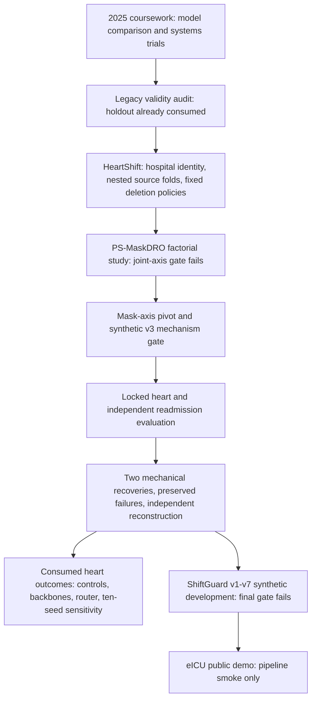
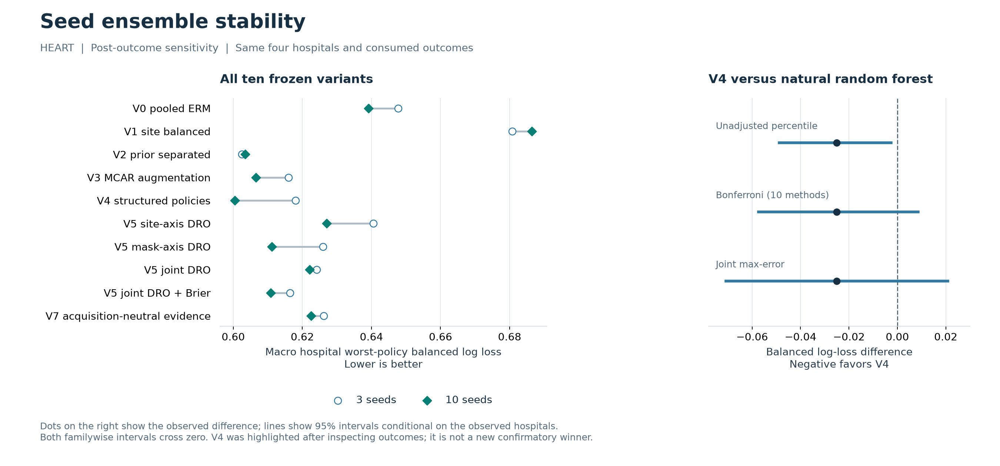
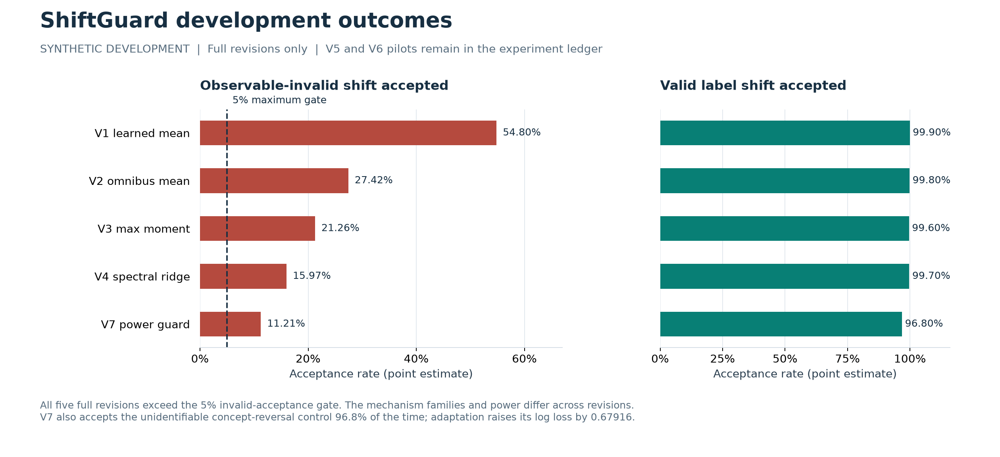

# Research atlas

HeartShift investigates whether source-trained models retain useful probability
estimates when both the hospital population and recorded measurements change.
The study developed from a coursework comparison into a hospital-held-out
benchmark, followed by experiments on adaptation, model selection, and ensembling.

This page connects each hypothesis to its implementation, evaluation, and
outcome. The [results](RESULTS.md) contain the complete method tables and
registered comparisons. The [experiment ledger](research/EXPERIMENT_LEDGER.md)
also records pilots, failed runs, recovery events, and pipeline smoke tests.

## Development and evidence flow



The arrows describe development relationships, not new independent datasets.
The heart sample remains 920 records at four historical hospitals. Repeated
methods, policies, and seeds do not increase that sample. The heart endpoint is
angiographic disease status, as defined by the [UCI source](https://archive.ics.uci.edu/dataset/45/heart+disease).

## Methods and experimental decisions

| Workstream | Implementation | Evidence | Outcome |
| --- | --- | --- | --- |
| Hospital-by-policy benchmark | Explicit hospital identity, nested source-only selection, deletion-only policies, balanced proper scores, sample-level reconstruction | [Benchmark card](BENCHMARK_CARD.md), [masks](../src/heartshift/masks.py), [outer report](HEART_OUTER_V5_RESULT.md) | A reusable, auditable evaluation design for this dataset and policy bank. |
| Prior separation | Equal class and hospital weighting, with a controlled V0-V2 ladder | [PS-MaskDRO implementation](../src/heartshift/models/ps_maskdro.py), [method specification](METHOD_SPECIFICATION.md) | V2 had the lowest locked primary point estimate, 0.602509. This is an observed benchmark result. |
| Measurement-policy DRO | Separate mean-risk, site-axis, mask-axis, joint-axis, and Brier variants | [Source gate and pivot](../artifacts/runs/psmask-inner-confirm-v1/), [locked heart result](HEART_OUTER_V5_RESULT.md) | Joint-axis source gate failed. The preselected mask-axis candidate did not confirm superiority over logistic regression on heart data. |
| Acquisition-Neutral Evidence (ANE) | Subtract a source-derived reference patient's representation under the identical observed-feature mask | [Observed-set encoder](../src/heartshift/models/observed_set.py), [V7 definition](METHOD_SPECIFICATION.md) | Implemented and ablated; no supported universal advantage or separate architectural novelty claim. |
| Assumption-gated prevalence correction | Combine source cross-fitting, named interventions, acquisition-aware diagnostics, support checks, and abstention | [Adaptation code](../src/heartshift/adaptation.py), [synthetic v3 result](SYNTHETIC_V3_RESULT.md), [heart abstention result](HEART_OUTER_V5_RESULT.md) | Registered synthetic mechanisms passed; all 432 real heart adaptation cells abstained. No successful real-data adaptation claim. |
| ShiftGuard | Iterative learned/omnibus/moment/spectral/quantile-copula diagnostics and a power guard | [Implementation](../src/heartshift/models/shiftguard.py), [revision report](SHIFTGUARD_DEVELOPMENT_RESULT.md) | Full v7 still accepted 11.21% of observable-invalid shifts against a 5% maximum gate. Closed negative result. |
| Support-aware expert routing | Source-selected weights over prior-separated, policy-robust, and anchor experts | [Router implementation](../src/heartshift/models/support_shrinkage.py), [development report](HEART_RESEARCH_DEVELOPMENT_RESULT.md) | Router BLL 0.619081 versus 0.615985 for equal-logit blending; robust-improvement gate failed. |
| Matched backbones and seed averaging | Equal-budget attention/DeepSets controls, exact mask pairing, and a ten-seed extension that reproduces the original three fits | [Development report](HEART_RESEARCH_DEVELOPMENT_RESULT.md), [stability tables](../artifacts/reports/historical-psmask-ten-seed-sensitivity-v2-stability/) | Averaging helped point estimates. Familywise intervals do not establish V4 superiority; evidence is post-outcome. |
| Independent readmission task | Patient-disjoint evaluation with an admission-source domain proxy and measurement deletions | [Readmission result](READMISSION_OUTER_V3_RESULT.md) | Joint PS-MaskDRO improved an exploratory worst-mask contrast, while pooled ERM retained higher AUROC. This is not external heart validation. |
| Coursework systems trials | Model comparisons, calibration, SHAP, descriptive subgroups, Dask, and a Colab HTTP latency experiment | [Recovered coursework](legacy/COURSEWORK_PROVENANCE.md), [legacy validity audit](legacy/VALIDITY_AUDIT.md) | Historical development and execution evidence. Dask's alignment defect and the latency workload limits remain explicit. |

BLL means balanced log loss; lower is better. These rows represent different
questions and evidence classes, so their scores are not one pooled leaderboard.

## Results with their limits visible

### Seed averaging



All ten variants are shown, including the two whose ten-seed point estimates
worsened. The right panel highlights V4 after outcome inspection and therefore
shows both unadjusted and familywise uncertainty. V4's ten-seed BLL is 0.600458;
its Bonferroni interval versus random forest is [-0.057290, 0.008648]. The four
observed hospitals and fitted models define the inference boundary.

[Plotted variant data](../assets/research/ensemble_stability.csv) ·
[Plotted intervals](../assets/research/v4_interval_context.csv) ·
[Vector figure](../assets/research/ensemble_stability.svg) ·
[Full stability report](../artifacts/reports/historical-psmask-ten-seed-sensitivity-v2-stability/)

### ShiftGuard revisions



The full revisions are shown separately from v5/v6 pilots. Revision mechanism
banks differ, so this is development history rather than a controlled
same-distribution comparison. V7's concept-reversal control remains a direct
counterexample to arbitrary concept-shift detection from unlabelled data.

[Plotted revision data](../assets/research/shiftguard_revision_limits.csv) ·
[Vector figure](../assets/research/shiftguard_revision_limits.svg) ·
[Full negative-result report](SHIFTGUARD_DEVELOPMENT_RESULT.md)

### Locked heart and independent-task figures

The earlier publication bundle already contains a
[robustness/AUROC comparison](../artifacts/figures/heartshift-v5-r2/heart_robustness_vs_auc.png),
[paired-bootstrap forest](../artifacts/figures/heartshift-v5-r2/heart_registered_bootstrap_forest.png),
[hospital-specific heatmap](../artifacts/figures/heartshift-v5-r2/heart_site_worst_heatmap.png),
[adaptation-abstention analysis](../artifacts/figures/heartshift-v5-r2/heart_rejected_adaptation.png),
and [readmission comparison](../artifacts/figures/heartshift-v5-r2/readmission_worst_mask.png).
Their [manifest](../artifacts/figures/heartshift-v5-r2/figure_manifest.json)
binds the PNG, PDF, and plotted-data CSV files. These are descriptive presentations
of existing results; they do not create new registered comparisons.

## Relationship to prior work

The method families build on established work in distribution shift, robust
optimization, and prevalence estimation. The table distinguishes those
foundations from the combinations and evaluations implemented in this project.

| Foundation | Existing work | HeartShift's relationship |
| --- | --- | --- |
| Tabular distribution-shift benchmarks | [TableShift](https://proceedings.neurips.cc/paper_files/paper/2023/hash/a76a757ed479a1e6a5f8134bea492f83-Abstract-Datasets_and_Benchmarks.html) | Related benchmark setting; HeartShift focuses on its named hospital and deletion-policy contract. |
| Missingness shift | [Zhou, Balakrishnan and Lipton](https://proceedings.mlr.press/v206/zhou23b.html) | The problem of changing measurement/missingness mechanisms predates this project. |
| Group distributionally robust optimization | [Sagawa et al.](https://arxiv.org/abs/1911.08731) | Worst-group optimization is prior work; HeartShift studies its site and policy axes through controlled variants. |
| Robust tabular prediction under missingness shifts | [MIRRAMS](https://arxiv.org/abs/2507.08280) | An external method control on the common backbone; it is not a HeartShift invention. |
| Black-box label-shift estimation | [Lipton, Wang and Smola](https://proceedings.mlr.press/v80/lipton18a.html) | BBSE is an attributed estimator, not a newly invented component of the compatibility gate. |

The contribution supported by the experiments is an auditable benchmark and
evidence about ensemble stability, adaptation assumptions, and source-only
selection. Broader method novelty and clinical validity remain unestablished.
The independent readmission task and eICU pipeline smoke test retain their
separate endpoints and evidence scopes.

## Rebuild and verify the presentation

```powershell
uv run python tools/build_research_atlas.py --check
uv run python tools/build_results_document.py --check
uv run python tools/plot_research_overview.py --check
```

To rebuild the generated index or figures, run the same command without
`--check`. These tools read existing evidence; they do not train models or open
an evaluation for method selection. New artifact directories require an explicit
entry in the classification file. Figure source tables, exported plot data, and
image hashes are recorded in the [figure manifest](../assets/research/figure_manifest.json).

Frozen protocols, raw inputs, sample-level predictions, old figures, and historical
reports remain at their original paths. Current interpretation belongs in this
atlas and the [claim/evidence crosswalk](../paper/CLAIM_EVIDENCE_CROSSWALK.md).
