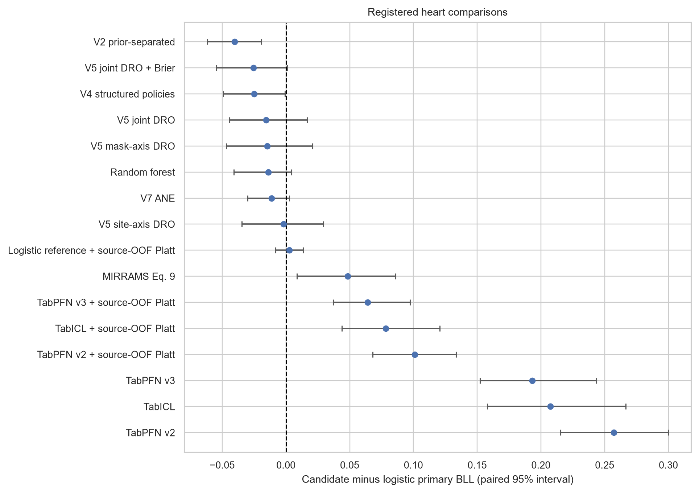
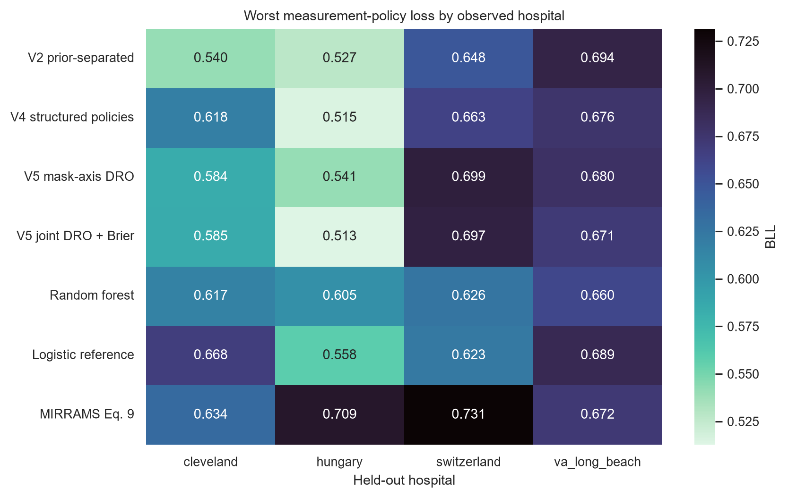
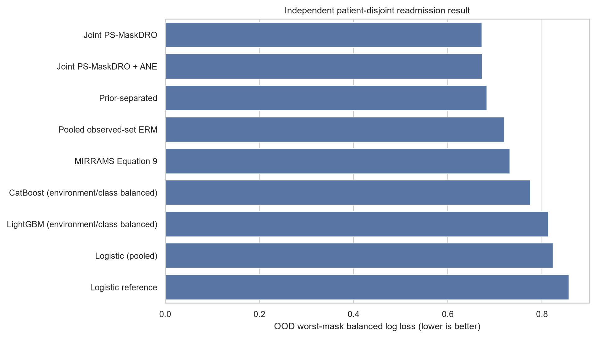

# Experiment results

These tables reproduce the retained report aggregates. Values are rounded to six decimal places for reading; source CSVs retain their stored precision. Method IDs match the report keys, including training weights, calibration, and seed count. Each primary table includes its complete reported method set.

[Heart](#locked-heart-evaluation) · [Readmission](#independent-readmission-task) · [Backbones and routing](#backbones-and-routing) · [Seed stability](#seed-stability) · [Adaptation](#adaptation-and-diagnostics) · [Legacy work](#legacy-and-systems-experiments)

## Findings

Balanced log loss (BLL) measures probability quality with equal class weight; lower is better. The heart primary metric averages each hospital's worst measurement-policy loss. These experiments have different evidence scopes.

| Experiment | Recorded result | Interpretation |
| --- | --- | --- |
| [Locked heart evaluation](RESULTS.md#locked-heart-evaluation) | V2 prior separation: **0.602509**. Preselected V5 mask-axis DRO: 0.625949. | V2 had the lowest point estimate among 45 methods. V5's registered interval against logistic regression crossed zero. |
| [Ten-seed sensitivity](RESULTS.md#seed-stability) | V4 structured policies: **0.600458**; random forest: 0.625463. | Post-outcome analysis. Familywise intervals crossed zero; superiority remains unconfirmed. |
| [Independent readmission task](RESULTS.md#independent-readmission-task) | Joint PS-MaskDRO: **0.672257**; pooled ERM: 0.719939. | Exploratory direct contrast favors DRO on worst-mask loss. ERM retained higher natural-policy AUROC. |
| [Support-aware routing](RESULTS.md#backbones-and-routing) | Router: 0.619081; equal-logit blend: **0.615985**. | The router failed its robust-improvement gate. |

The heart compatibility gate abstained in all 432 evaluated adaptation cells. The separate ShiftGuard development study failed its final acceptance gate. Both outcomes are documented in [adaptation and diagnostics](RESULTS.md#adaptation-and-diagnostics).

## Reading the metrics

| Quantity | Definition | Interpretation |
| --- | --- | --- |
| Primary heart BLL | Mean across hospitals of each hospital's worst-policy balanced log loss | Lower is better; four hospitals receive equal weight. |
| Worst site-policy BLL | Maximum loss over all hospital/policy cells | Lower is better; exposes the most difficult observed cell. |
| Natural macro AUROC | Mean hospital AUROC with the naturally recorded feature panel | Higher is better; measures discrimination rather than probability quality. |
| Readmission OOD worst-mask BLL | Worst deletion-policy BLL in the held-out admission-source environment | A separate endpoint and domain definition; do not pool with heart scores. |
| Bootstrap mean difference | Mean candidate-minus-reference difference over paired resamples | Not the subtraction of the two point estimates. Negative favors the candidate. |

Heart intervals resample records within the four observed hospitals and condition on the fitted models. Readmission intervals resample patient clusters. Neither estimates performance over a population of future hospitals. Repeated policies and seeds do not increase the number of patients. Bootstrap fractions favoring a method are descriptive, not p-values. [Metric contract](BENCHMARK_CARD.md).

## Locked heart evaluation

**Scope:** zero-shot disease classification on 920 records from four historical referred cohorts. The endpoint is angiographic disease status (`num > 0`). The final report combines frozen classical/modern predictions, recovered MIRRAMS aggregation, and the once-run PS-MaskDRO evaluation. The two mechanical recoveries remain disclosed in the [execution report](HEART_OUTER_V5_RESULT.md).


The figure shows nine named methods for readability, including the preselected candidate, the logistic reference, random forest, pooled ERM, and MIRRAMS. It is a descriptive selection made after evaluation. The complete table below contains all 45 methods, including calibrated variants and weaker results. [Figure data](../assets/research/locked_heart_overview.csv) · [SVG](../assets/research/locked_heart_overview.svg).

<details>
<summary>All 45 locked methods</summary>

| Method ID | Primary BLL ↓ | Worst site-policy BLL ↓ | Natural macro AUROC ↑ |
| --- | ---: | ---: | ---: |
| `psmask:v2_prior_separated` | 0.602509 | 0.693879 | 0.818322 |
| `psmask:v3_mcar_augmentation` | 0.615956 | 0.671808 | 0.803983 |
| `psmask:v5_site_mask_dro_brier` | 0.616442 | 0.697024 | 0.812055 |
| `psmask:v4_structured_policy_bank` | 0.618071 | 0.676198 | 0.806451 |
| `psmask:v5_site_mask_dro` | 0.624153 | 0.697823 | 0.801924 |
| `psmask:v5_mask_only_dro` | 0.625949 | 0.699207 | 0.801486 |
| `psmask:v7_ane` | 0.626150 | 0.666540 | 0.804883 |
| `classical:random_forest:site_class_balanced` | 0.627031 | 0.660195 | 0.804629 |
| `classical:logistic:site_class_balanced` | 0.634591 | 0.688636 | 0.798881 |
| `classical:logistic:site_class_balanced:source_oof_platt` | 0.638490 | 0.694130 | 0.798881 |
| `classical:random_forest:site_class_balanced:source_oof_platt` | 0.639099 | 0.701700 | 0.804672 |
| `psmask:v5_site_only_dro` | 0.640500 | 0.739378 | 0.806484 |
| `classical:xgboost:site_class_balanced:source_oof_platt` | 0.645828 | 0.727553 | 0.794377 |
| `psmask:v0_pooled_erm` | 0.647779 | 0.752087 | 0.828615 |
| `classical:hist_gradient_boosting:site_class_balanced:source_oof_platt` | 0.657183 | 0.733641 | 0.789114 |
| `classical:logistic:pooled:source_oof_platt` | 0.661872 | 0.746381 | 0.813676 |
| `classical:lightgbm:site_class_balanced:source_oof_platt` | 0.665599 | 0.758429 | 0.784099 |
| `classical:xgboost:site_class_balanced` | 0.669717 | 0.797203 | 0.794437 |
| `classical:catboost:site_class_balanced:source_oof_platt` | 0.676150 | 0.767252 | 0.797078 |
| `modern_2026:ft_transformer:pooled:source_oof_platt` | 0.679120 | 0.808081 | 0.805413 |
| `psmask:v1_site_balanced` | 0.680723 | 0.787979 | 0.803611 |
| `classical:core_logistic:pooled:source_oof_platt` | 0.681321 | 0.789818 | 0.781552 |
| `mirrams:mirrams_equation9` | 0.686618 | 0.731403 | 0.793852 |
| `classical:elastic_net_logistic:site_class_balanced:source_oof_platt` | 0.691074 | 0.693189 | 0.541472 |
| `tabpfn_v3:tabpfn:pooled:source_oof_platt` | 0.701261 | 0.872315 | 0.810304 |
| `classical:catboost:site_class_balanced` | 0.705865 | 0.876716 | 0.797095 |
| `classical:mask_logistic:pooled:source_oof_platt` | 0.708334 | 0.744637 | 0.527729 |
| `modern_2026:tabicl:pooled:source_oof_platt` | 0.713385 | 0.934769 | 0.807210 |
| `modern_2026:tabm:pooled:source_oof_platt` | 0.713585 | 0.778759 | 0.804684 |
| `classical:lightgbm:site_class_balanced` | 0.734972 | 0.907705 | 0.784121 |
| `classical:hist_gradient_boosting:site_class_balanced` | 0.737184 | 0.883547 | 0.789114 |
| `modern_v2:tabpfn:pooled:source_oof_platt` | 0.739370 | 1.012586 | 0.806590 |
| `modern_v2:ebm:site_class_balanced:source_oof_platt` | 0.742082 | 0.823637 | 0.796334 |
| `classical:logistic:pooled` | 0.745383 | 0.849074 | 0.813676 |
| `classical:core_logistic:pooled` | 0.746582 | 0.871346 | 0.781552 |
| `modern_2026:realmlp:pooled:source_oof_platt` | 0.778172 | 1.059654 | 0.797192 |
| `modern_v2:ebm:site_class_balanced` | 0.810680 | 1.056452 | 0.796151 |
| `modern_2026:ft_transformer:pooled` | 0.826205 | 1.163109 | 0.805504 |
| `tabpfn_v3:tabpfn:pooled` | 0.827998 | 1.045859 | 0.810348 |
| `modern_2026:tabicl:pooled` | 0.840849 | 1.083068 | 0.807252 |
| `modern_v2:tabpfn:pooled` | 0.894870 | 1.185910 | 0.806642 |
| `classical:elastic_net_logistic:site_class_balanced` | 0.924470 | 1.010551 | 0.539399 |
| `modern_2026:realmlp:pooled` | 0.977520 | 1.191069 | 0.800390 |
| `classical:mask_logistic:pooled` | 1.038259 | 1.405206 | 0.527729 |
| `modern_2026:tabm:pooled` | 1.042612 | 1.506819 | 0.808855 |

[Source table](../artifacts/reports/heart-outer-v5/primary_estimands.csv)

</details>

### Registered comparisons

All 16 registered comparisons use `classical:logistic:site_class_balanced` as the reference and 2,000 paired replicates. These are the saved marginal 95% intervals, without a new familywise adjustment. In particular, the preselected mask-axis candidate's interval crosses zero. A lowest point estimate across 45 methods does not establish general superiority.

<details>
<summary>All 16 registered contrasts</summary>

| Method ID | Bootstrap mean Δ BLL | 95% percentile interval |
| --- | ---: | ---: |
| `psmask:v2_prior_separated` | -0.040378 | [-0.061661, -0.019375] |
| `psmask:v5_site_mask_dro_brier` | -0.025633 | [-0.054501, 0.000946] |
| `psmask:v4_structured_policy_bank` | -0.024840 | [-0.049031, -0.000697] |
| `psmask:v5_site_mask_dro` | -0.015511 | [-0.044374, 0.016672] |
| `psmask:v5_mask_only_dro` | -0.014664 | [-0.046858, 0.020709] |
| `classical:random_forest:site_class_balanced` | -0.013824 | [-0.040897, 0.004482] |
| `psmask:v7_ane` | -0.011263 | [-0.030170, 0.002674] |
| `psmask:v5_site_only_dro` | -0.001790 | [-0.034745, 0.029373] |
| `classical:logistic:site_class_balanced:source_oof_platt` | 0.002593 | [-0.008087, 0.013391] |
| `mirrams:mirrams_equation9` | 0.048310 | [0.008696, 0.085842] |
| `tabpfn_v3:tabpfn:pooled:source_oof_platt` | 0.064121 | [0.037030, 0.097209] |
| `modern_2026:tabicl:pooled:source_oof_platt` | 0.078376 | [0.043774, 0.120574] |
| `modern_v2:tabpfn:pooled:source_oof_platt` | 0.101055 | [0.068098, 0.133515] |
| `tabpfn_v3:tabpfn:pooled` | 0.193188 | [0.152220, 0.243388] |
| `modern_2026:tabicl:pooled` | 0.207363 | [0.157957, 0.266422] |
| `modern_v2:tabpfn:pooled` | 0.257045 | [0.215335, 0.299797] |

[Source table](../artifacts/reports/heart-outer-v5/paired_bootstrap_intervals.csv)

</details>



### Hospital heterogeneity



The heatmap is a selected descriptive view. The [complete site-policy table](../artifacts/reports/heart-outer-v5/site_policy_metrics.csv) contains all methods. Switzerland has only eight negative records; aggregate precision must not conceal that limitation. [Recorded-sex strata](../artifacts/reports/heart-outer-v5/descriptive_sex_subgroup_metrics.csv) are descriptive subgroup evidence, not a comprehensive fairness evaluation.

## Independent readmission task

**Scope:** patient-disjoint any-readmission classification, with admission source as a domain proxy. The evaluation covers 54,287 encounters from 39,597 patients. This task supplies cross-task evidence about measurement robustness. It does not validate heart-disease prediction. ID and OOD refer to the study's admission-source environments.

| Method ID | ID natural BLL ↓ | OOD natural BLL ↓ | OOD worst-mask BLL ↓ | OOD natural AUROC ↑ |
| --- | ---: | ---: | ---: | ---: |
| `ps_maskdro` | 0.655134 | 0.653706 | 0.672257 | 0.660040 |
| `ps_maskdro_ane` | 0.654018 | 0.653616 | 0.673223 | 0.663105 |
| `prior_separated` | 0.655243 | 0.656067 | 0.683204 | 0.654332 |
| `pooled_erm` | 0.687801 | 0.682186 | 0.719939 | 0.674716 |
| `mirrams_equation9` | 0.717441 | 0.701483 | 0.732008 | 0.672731 |
| `catboost_environment_class_balanced` | 0.656718 | 0.663678 | 0.775740 | 0.649144 |
| `lightgbm_environment_class_balanced` | 0.670463 | 0.679370 | 0.813775 | 0.640793 |
| `logistic_pooled` | 0.693565 | 0.700860 | 0.823806 | 0.664475 |
| `logistic_environment_class_balanced` | 0.700163 | 0.716891 | 0.857545 | 0.621875 |

[All nine methods and additional Brier metrics](../artifacts/reports/readmission-outer-v3/primary_estimands.csv)



All five registered contrasts below use `logistic_environment_class_balanced` as the reference and 2,000 patient-cluster replicates. Direct comparisons of PS-MaskDRO with ERM, prior separation, or ANE are exploratory; their interpretation and paired-replicate derivation are in the [readmission report](READMISSION_OUTER_V3_RESULT.md). Pooled ERM retains the highest natural OOD AUROC, so the robust-loss result does not imply superiority on every metric.

| Method ID | Bootstrap mean Δ BLL | 95% percentile interval |
| --- | ---: | ---: |
| `mirrams_equation9` | -0.125544 | [-0.130264, -0.120791] |
| `pooled_erm` | -0.137608 | [-0.142206, -0.132915] |
| `prior_separated` | -0.174357 | [-0.179613, -0.168961] |
| `ps_maskdro` | -0.185294 | [-0.190676, -0.179941] |
| `ps_maskdro_ane` | -0.184328 | [-0.189807, -0.178852] |

[Source table](../artifacts/reports/readmission-outer-v3/patient_cluster_bootstrap_intervals.csv)

## Backbones and routing

**Scope:** development after the heart outcomes had already been inspected. Source-only selection and a pre-execution development freeze constrain the implementation; they do not make these reused outcomes confirmatory. The matched report contains 16 methods. Ensembles and individual architectures retain their distinct identifiers.

<details>
<summary>All 16 development methods</summary>

| Method ID | Primary BLL ↓ | Worst site-policy BLL ↓ | Natural macro AUROC ↑ |
| --- | ---: | ---: | ---: |
| `neural_ensemble:all_backbones_equal` | 0.615091 | 0.679221 | 0.819401 |
| `router:equal_logit_blend` | 0.615985 | 0.678704 | 0.822516 |
| `neural_ensemble:v5_backbones_equal` | 0.617555 | 0.689133 | 0.816810 |
| `neural_ensemble:v2_backbones_equal` | 0.617661 | 0.672515 | 0.820432 |
| `router:support_aware_router` | 0.619081 | 0.683776 | 0.820563 |
| `neural:v5_attention_equal_budget` | 0.620525 | 0.677090 | 0.808827 |
| `router:selected_convex_blend` | 0.620727 | 0.701267 | 0.817779 |
| `control:random_forest_natural` | 0.625463 | 0.665065 | 0.803536 |
| `neural:v2_attention_equal_budget` | 0.625945 | 0.688323 | 0.809242 |
| `neural:v2_deepsets_equal_budget` | 0.626937 | 0.700161 | 0.819399 |
| `neural:v5_deepsets_equal_budget` | 0.628191 | 0.712564 | 0.819103 |
| `control:logistic_natural` | 0.634591 | 0.688636 | 0.798881 |
| `control:random_forest_structured` | 0.634611 | 0.757370 | 0.800944 |
| `control:logistic_structured` | 0.637716 | 0.740845 | 0.796457 |
| `control:histgb_structured` | 0.655221 | 0.800620 | 0.780164 |
| `control:histgb_natural` | 0.720652 | 0.886503 | 0.779158 |

[Source table](../artifacts/reports/heart-research-development-v1/primary_estimands.csv)

</details>

| Router check | Recorded outcome |
| --- | --- |
| descriptive natural auroc noninferiority | Passed |
| descriptive robust improvement over strongest fixed | Failed |
| router not collapsed | Passed |

[Router gate record](../artifacts/runs/support-router-outer-development-v1/router_gates.json). Passing non-collapse and AUROC checks does not override the failed robust-improvement criterion. [Paired contrasts](../artifacts/reports/heart-research-development-v1/paired_contrast_intervals.csv) · [Individual-seed results](../artifacts/reports/heart-research-development-v1/individual_seed_sensitivity.csv) · [Selection and interpretation](HEART_RESEARCH_DEVELOPMENT_RESULT.md).

## Seed stability

**Scope:** post-outcome exact seed extension. All ten historical PS-MaskDRO variants were extended from three to ten seeds using their retained selections. The original three-seed predictions reproduced exactly. The stability report contains those 20 ensembles and two classical controls; they are shown together only within this sensitivity study.


<details>
<summary>All 22 stability-report methods</summary>

| Method ID | Primary BLL ↓ | Worst site-policy BLL ↓ | Natural macro AUROC ↑ |
| --- | ---: | ---: | ---: |
| `psmask10:v4_structured_policy_bank` | 0.600458 | 0.664595 | 0.818196 |
| `psmask3:v2_prior_separated` | 0.602509 | 0.693879 | 0.818322 |
| `psmask10:v2_prior_separated` | 0.603434 | 0.672357 | 0.816537 |
| `psmask10:v3_mcar_augmentation` | 0.606547 | 0.678903 | 0.805688 |
| `psmask10:v5_site_mask_dro_brier` | 0.610812 | 0.697117 | 0.810965 |
| `psmask10:v5_mask_only_dro` | 0.611190 | 0.690469 | 0.813436 |
| `psmask3:v3_mcar_augmentation` | 0.615956 | 0.671808 | 0.803983 |
| `psmask3:v5_site_mask_dro_brier` | 0.616442 | 0.697024 | 0.812055 |
| `psmask3:v4_structured_policy_bank` | 0.618071 | 0.676198 | 0.806451 |
| `psmask10:v5_site_mask_dro` | 0.622119 | 0.696564 | 0.804021 |
| `psmask10:v7_ane` | 0.622504 | 0.654763 | 0.804258 |
| `psmask3:v5_site_mask_dro` | 0.624153 | 0.697823 | 0.801924 |
| `control:random_forest_natural` | 0.625463 | 0.665065 | 0.803536 |
| `psmask3:v5_mask_only_dro` | 0.625949 | 0.699207 | 0.801486 |
| `psmask3:v7_ane` | 0.626150 | 0.666540 | 0.804883 |
| `psmask10:v5_site_only_dro` | 0.627001 | 0.711235 | 0.812844 |
| `control:logistic_natural` | 0.634591 | 0.688636 | 0.798881 |
| `psmask10:v0_pooled_erm` | 0.639120 | 0.751067 | 0.815454 |
| `psmask3:v5_site_only_dro` | 0.640500 | 0.739378 | 0.806484 |
| `psmask3:v0_pooled_erm` | 0.647779 | 0.752087 | 0.828615 |
| `psmask3:v1_site_balanced` | 0.680723 | 0.787979 | 0.803611 |
| `psmask10:v1_site_balanced` | 0.686456 | 0.826954 | 0.818331 |

[Source table](../artifacts/reports/historical-psmask-ten-seed-sensitivity-v2-stability/primary_estimands.csv)

</details>

V4 was highlighted after outcome inspection. Its familywise intervals against natural random forest cross zero. The complete ten-method adjustment is shown below; the highlighted method is not treated as a new prespecified winner.

<details>
<summary>Familywise intervals for all ten extended variants</summary>

| Method ID | Bonferroni percentile 95% interval | Joint max-error 95% interval |
| --- | ---: | ---: |
| `psmask10:v0_pooled_erm` | [-0.020324, 0.053172] | [-0.032205, 0.059519] |
| `psmask10:v1_site_balanced` | [0.004309, 0.132068] | [0.015131, 0.106855] |
| `psmask10:v2_prior_separated` | [-0.053819, 0.016918] | [-0.067891, 0.023833] |
| `psmask10:v3_mcar_augmentation` | [-0.057851, 0.034630] | [-0.064778, 0.026946] |
| `psmask10:v4_structured_policy_bank` | [-0.057290, 0.008648] | [-0.070867, 0.020857] |
| `psmask10:v5_mask_only_dro` | [-0.053979, 0.029250] | [-0.060136, 0.031589] |
| `psmask10:v5_site_mask_dro` | [-0.044157, 0.040653] | [-0.049206, 0.042518] |
| `psmask10:v5_site_mask_dro_brier` | [-0.053351, 0.029249] | [-0.060513, 0.031211] |
| `psmask10:v5_site_only_dro` | [-0.041386, 0.042360] | [-0.044324, 0.047400] |
| `psmask10:v7_ane` | [-0.029647, 0.050263] | [-0.048821, 0.042903] |

[Source table](../artifacts/reports/historical-psmask-ten-seed-sensitivity-v2-stability/posthoc_multiplicity_sensitivity.csv)

</details>

[Three-versus-ten-seed data](../artifacts/reports/historical-psmask-ten-seed-sensitivity-v2-stability/three_vs_ten_seed_comparison.csv) · [Exact reproduction audit](../artifacts/reports/historical-psmask-ten-seed-sensitivity-v2-stability/exact_reproduction.json) · [Single-seed sensitivity](../artifacts/reports/historical-psmask-ten-seed-sensitivity-v2-stability/ten_seed_sensitivity.csv).

## Adaptation and diagnostics

### Heart abstention

The compatibility gate accepted zero of 432 adaptable method/site/policy/replicate cells. The automatic report therefore contains only zero-shot predictions. The following post-hoc analysis scores the already-fixed research probabilities to explain what the gate rejected. These probabilities were not automatic UDA outputs.

| Variant | Research track | Macro worst-policy BLL ↓ |
| --- | --- | ---: |
| `v2_prior_separated` | zero-shot | 0.602509 |
| `v5_mask_only_dro` | zero-shot | 0.625949 |
| `v2_prior_separated` | equal-prior calibrated | 0.610084 |
| `v5_mask_only_dro` | equal-prior calibrated | 0.626195 |
| `v2_prior_separated` | soft-BBSE (research only) | 1.687476 |
| `v5_mask_only_dro` | soft-BBSE (research only) | 1.879558 |
| `v2_prior_separated` | MLLS (research only) | 1.929936 |
| `v5_mask_only_dro` | MLLS (research only) | 2.014169 |

[Complete plotted-data export](../artifacts/figures/heartshift-v5-r2/heart_rejected_adaptation.csv) · [Original abstention analysis](HEART_OUTER_V5_RESULT.md#adaptation-abstention-result).

### Registered synthetic mechanisms

The earlier synthetic v3 study passed all eight registered checks on its named mechanisms. This is a separate protocol from the later ShiftGuard revisions. Success on this mechanism bank does not establish unrestricted MNAR or concept-shift robustness.

| Registered check | Observed | Requirement | Outcome |
| --- | ---: | --- | --- |
| `required_seeds_per_cell` | 3.000000 | >= 3.000000 | Passed |
| `label_only_diagnostic_acceptance` | 1.000000 | >= 0.666667 | Passed |
| `label_only_mlls_prevalence_error` | 0.006960 | <= 0.120000 | Passed |
| `label_only_adapted_log_loss_delta` | -0.023172 | <= 0.000000 | Passed |
| `mar_policy_maskdro_balanced_log_loss_delta` | 0.013700 | <= 0.020000 | Passed |
| `mar_policy_shift_diagnostic_acceptance` | 0.000000 | <= 0.500000 | Passed |
| `conditional_only_diagnostic_acceptance` | 0.000000 | <= 0.500000 | Passed |
| `mnar_outcome_only_diagnostic_acceptance` | 0.000000 | <= 0.500000 | Passed |

[Synthetic v3 gate](../artifacts/runs/synthetic-mechanism-v3/acceptance_gate.json) · [Execution and reconstruction](SYNTHETIC_V3_RESULT.md).

### ShiftGuard development

Five full revisions are reported below; v5/v6 pilots remain in the [experiment ledger](research/EXPERIMENT_LEDGER.md). The revision mechanism banks and power differ, so this is a development sequence rather than a matched cross-version efficacy experiment. Every full revision exceeds the 5% maximum observable-invalid acceptance gate.


| Full revision | Valid acceptance | Observable-invalid acceptance | Concept-control acceptance | Concept Δ log loss |
| --- | ---: | ---: | ---: | ---: |
| `v1_learned_mean` | 99.90% | 54.80% | 100.00% | 0.668766 |
| `v2_omnibus_mean` | 99.80% | 27.42% | 99.70% | 0.679756 |
| `v3_max_moment` | 99.60% | 21.26% | 99.70% | 0.672858 |
| `v4_spectral_ridge` | 99.70% | 15.97% | 99.90% | 0.677194 |
| `v7_power_guard` | 96.80% | 11.21% | 96.80% | 0.679162 |

[Source table](../artifacts/reports/shiftguard-revisions-v3-final-development/revision_comparison.csv). Positive concept-control Δ log loss means adaptation worsened the score. The concept-reversal counterexample remains visible alongside observable-shift failures. [Revision interpretation](SHIFTGUARD_DEVELOPMENT_RESULT.md).

## Legacy and systems experiments

The [original four-model holdout table](legacy/LEGACY_BENCHMARK.md) belongs to a repeatedly inspected coursework split. It is historical development evidence and is not comparable to the leave-one-hospital-out results above. [Recovered coursework](legacy/COURSEWORK_PROVENANCE.md) includes per-fold CV, calibration, SHAP, descriptive subgroups, and training diagnostics.

The Dask trial retains its row/label alignment failure. The Colab latency trial measures its recorded loopback workload; its historical `throughput_rps` field is a reciprocal-latency proxy. The eICU public-demo run is a [pipeline smoke test](EICU_DEMO_SMOKE_RESULT.md). None supplies clinical deployment evidence.

## Reproduce these tables

```powershell
uv run python tools/build_results_document.py --check
uv run python tools/plot_research_overview.py --check
```

Omit `--check` to rebuild the presentation from the same saved reports. No model is fitted or selected. The [presentation manifest](research/result_presentation_manifest.json) binds all input tables and gate records to this document. Original prediction reconstruction is a separate [full-evidence check](USAGE.md#evidence-checkout). [Development and attribution](RESEARCH_ATLAS.md) · [Complete run ledger](research/EXPERIMENT_LEDGER.md).
